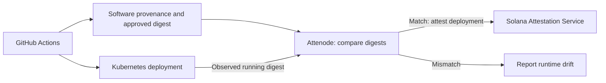

# Attenode

**Verifiable identity for production software.**

Attenode connects software provenance with runtime state and constructs verifiable deployment attestations using Solana Attestation Service (SAS).

## Problem

CI/CD can establish what was built and what was intended to be deployed. That evidence alone does not independently prove that the same artifact is running in production. Manual changes or deployments outside the trusted pipeline can cause runtime state to diverge from the approved artifact.

## How it works

The intended MVP flow is GitHub Actions → software provenance → Kubernetes deployment → Attenode → SAS.

Attenode will compare the container digest observed in Kubernetes with the artifact approved by the deployment flow. A matching deployment can receive a SAS attestation linking its repository, commit, artifact and environment. Subsequent comparisons can detect runtime drift.



This diagram describes the target MVP; provenance verification and Kubernetes observation are still on the roadmap. An attestation records an issuer's deployment claim at a point in time. Its continued existence does not prove that runtime state remains unchanged.

### Trusted deployment and runtime drift

1. GitHub Actions builds a container with digest `sha256:aaa…` and supplies provenance for an approved commit.
2. Kubernetes runs that digest. Attenode observes a match and can attest the deployment.
3. Someone later changes the image outside the trusted flow to `sha256:bbb…`.
4. A new runtime comparison detects the mismatch. The previous attestation describes the earlier deployment, not the changed runtime.

## Attestation format

`DeploymentAttestationV1` serializes six string fields:

| Field | Meaning |
| --- | --- |
| `repository` | Source repository |
| `commitSha` | Git commit SHA |
| `artifactDigest` | Container artifact digest |
| `environment` | Deployment environment |
| `provenanceProvider` | Provenance provider; empty string when absent |
| `deployedAt` | Deployment timestamp |

## Current status

TypeScript/NodeNext prototype using `sas-lib@1.0.10` and `gill@0.14.0`. Implemented:

- Deployment model, validation and SAS payload serialization.
- Deterministic Credential, Schema and Attestation PDA derivation.
- SAS instruction and Gill transaction construction.
- Idempotent execution orchestration with injected signers and client/transport: skip existing Credential and Schema, reject an existing Attestation nonce, and await confirmation in dependency order.
- Offline executor tests covering bootstrap, collisions and failure propagation.

The current Schema creation flow uses version `1`. Attestation nonce and expiry are explicit inputs; expiry is a Unix timestamp in seconds. The planned MVP policy is 30 days, supplied by the caller.

**The real demo-api Devnet attestation has been independently verified by the operator. The SAS/runtime integration below was tested offline only. Attenode is not production-ready.** Offline tests do not validate live RPC behavior or runtime observations.

## Local development

Install dependencies with `npm install` when setting up a local checkout. With dependencies installed, these commands run the TypeScript check and offline SAS examples/tests:

```sh
npm run check
npm run demo:sas
npm run demo:sas:onchain
npm run demo:sas:transactions
npm run test:sas:executor
```

The demos construct payloads, instructions or unsigned transactions. Where signers are needed, they are generated in memory. The executor tests use fake transports and do not contact RPC. Despite its name, `demo:sas:onchain` only constructs instructions offline.

`npm test` is currently a placeholder; use the named offline test scripts. The explicit Devnet attestation CLI is documented below.

## Real demo-api Devnet attestation

Select `--payload demo-api` explicitly. Omitting it retains the controlled fixture
and its original nonce. The real image uses a separate deterministic nonce and
Attestation PDA: `HVjR8c5iF5mXegmboR54HB3EzRSTadb7j9L5D4uLq9WQ`.
The previous synthetic attestation is never reused as approval for this image.

The fixed operator-supplied inputs are:

| SAS field | Value |
| --- | --- |
| repository | `dariovjed/attenode` |
| commitSha | `bb2d3cf15f2b31137e8b5112770587d672458064` |
| artifactDigest | `sha256:3190be029b3730939206615819911fac3d6c5285d48eadd5c363826c950c9fee` |
| environment | `development` |
| provenanceProvider | Empty string |
| deployedAt | UTC timestamp captured for this invocation |

`artifactDigest` denotes the published OCI manifest digest. The image reference
is `ghcr.io/dariovjed/demo-api@sha256:3190be029b3730939206615819911fac3d6c5285d48eadd5c363826c950c9fee`.
The namespace `attenode-demo`, Deployment `demo-api`, container `demo-api`, and
image repository are displayed as context only: the existing six-field schema
does not attest them. `deployedAt` records the attestation invocation time, not an
independently measured Kubernetes deployment time. No verified build provenance
or independent GHCR/Kubernetes inspection is claimed by this CLI.

Offline preview (no RPC, wallet, or transaction):

```sh
npm run devnet:attestation -- --payload demo-api --preview
```

The following commands require separate operational authorization. Read-only
preflight contacts Solana Devnet and checks existing accounts; it loads no wallet:

```sh
npm run devnet:attestation -- --payload demo-api
```

Only explicit execution may load the existing repository-local wallet, validate
its public signer address, and submit a transaction:

```sh
npm run devnet:attestation -- --payload demo-api --execute
```

The CLI requires the existing Attenode credential and DeploymentAttestationV1
schema to pass ownership, discriminator and exact-content checks. It never
creates or changes either prerequisite. It validates the exact real-image inputs
before wallet loading, constructs one attestation instruction, and reads back the
created account to compare the exact serialized payload, nonce, issuer, expiry,
credential, schema, owner and discriminator. Wallet contents and external error
details are never printed; decoded private-key bytes are cleared after signer
creation using the existing mechanism.

Read-back only (Devnet reads, no wallet or submission; missing account fails):

```sh
npm run devnet:attestation -- --payload demo-api --verify-only
```

Read-back recovers the stored timestamp, requires canonical ISO formatting and
the original timestamp plus 30-day expiry, and compares all payload bytes against
the fixed inputs. Real-image read-back additionally checks the PDA and rejects
expired or future-dated attestations. Re-running execution verifies and skips an
existing matching, unexpired account; it never refreshes or overwrites it. The
fixed nonce supports one attestation for this identity; renewal needs a deliberate
new nonce policy. A send/confirmation failure can leave the outcome uncertain:
use read-back before retrying. Creation requires the approved wallet, funds and
valid existing Devnet prerequisites; none were checked live in this change.

Offline validation using already-installed dependencies:

```sh
npm run check
npm run test:devnet:demo-api
npm run test:devnet:attestation
npm run test:devnet:schema
npm run test:sas:executor
```

The new tests cover exact real-image serialization, fixture isolation, account
and payload tampering, expiry, unsigned transaction construction, CLI flag gates,
and offline previews. The controlled fixture tests remain unchanged.

## Security

### Read-only SAS + Kubernetes verification

`verify:k8s --sas` connects the existing real demo-api attestation to the runtime
verifier. Manual mode remains available with `--approved-image` and optional
`--approved-runtime-image-id`. Both manual approval flags are forbidden in SAS
mode, even if they contain the expected value. SAS mode requires explicit
Kubernetes context, namespace, Deployment, container and image repository; this
MVP accepts only the documented demo-api binding.

For separately authorized live read-only verification, replace the kubeconfig
placeholder with the explicitly approved path and select the approved context:

```sh
npm run verify:k8s -- --sas --kubeconfig <approved-kubeconfig-path> --context kind-attenode --namespace attenode-demo --deployment demo-api --container demo-api --image-repository ghcr.io/dariovjed/demo-api
```

Append `--json` for the full report. For machine parsing, use
`npm run --silent verify:k8s -- ... --json`. These commands contact Devnet and
Kubernetes and read the selected kubeconfig; they must not be run under an
offline-only authorization. No live verification was performed for this change.

The report separates SAS attestation validation, Kubernetes baseline agreement,
runtime artifact identity evidence, and the overall result:

- SAS reads use the fixed public Devnet endpoint with finalized commitment. The
  reader exposes account reads only and never loads a wallet, signs or submits.
  Existing validators check SAS ownership, serialized discriminator bytes,
  trusted credential/authority/signers, schema metadata/version/layout/pause
  state, account PDAs, nonce, signer, exact six-field payload and expiration.
  Repository, commit, environment, empty provenance provider and expected real
  digest are enforced by the existing real-image policy. Future timestamps are
  rejected; expiration is rechecked after runtime collection.
- The approved digest comes from the decoded, validated on-chain payload. The
  expected digest is a validation constraint, never a fallback approval. Missing
  or rejected SAS accounts prevent Kubernetes reader construction.
- Namespace, Deployment, container and image repository are explicit local
  binding policy, not on-chain claims. The approved Pod image reference is
  constructed as `<configured-image-repository>@<on-chain-artifactDigest>`.
- Kubernetes baseline agreement compares Pod configuration and readiness using
  the existing UID-based ownership adapter. A matching Pod specification alone
  cannot produce overall VERIFIED.
- Runtime artifact verification accepts only a canonical, registry-qualified
  `repository@sha256:<64 lowercase hex>` imageID, without a CRI prefix or tag,
  matching the approved image binding exactly. This deliberately supports the
  operator-verified GHCR imageID representation used by this demo. Bare hashes,
  Docker config IDs, `containerd://`, `docker://`, `docker-pullable://`, unknown
  prefixes, malformed or missing IDs are INDETERMINATE; no prefix is stripped.

Overall VERIFIED requires a valid unexpired SAS approval, baseline agreement,
and supported matching evidence for every selected ready Pod. Consistent image
or manifest drift yields TRUST_BROKEN. Missing/unsupported runtime evidence,
unready containers, incomplete collection, and mixed rollouts yield INDETERMINATE,
with per-Pod evidence retained. Returning all Pods to the approved immutable image
can yield VERIFIED again while the approval remains valid. Exit codes remain
`0` VERIFIED, `2` TRUST_BROKEN, `3` INDETERMINATE, `1` configuration/execution error.
SAS transport errors use exit 1 with sanitized diagnostics; Kubernetes read
failures retain the existing indeterminate collection behavior.

Diagnostic errors identify one of `CLI_ARGUMENTS`, `SAS_RPC`,
`SAS_ACCOUNT_VALIDATION`, `SAS_APPROVAL_BINDING`, `KUBERNETES_CLIENT`, or
`KUBERNETES_OBSERVATION`, followed by a stable error code, explanation and action.
All printed text comes from a fixed local catalog. Only allowlisted scalar error
categories are inspected for classification; raw errors, stacks, response bodies,
RPC URLs/credentials, authentication headers and kubeconfig contents are never
printed. Unknown errors receive a stage-specific fallback code.

The Devnet attestation CLI and SAS reader share `src/attestations/devnet-rpc.ts`:
the same explicit public URL, Gill client initializer and `fetchEncodedAccount`
base64/encoded-account handling. The working attestation CLI retains confirmed
reads; runtime approval retains finalized reads, with no automatic downgrade.
RPC diagnostics now include allowlisted `operation` values (`RPC_INITIALIZATION`,
`ACCOUNT_FETCH`, `RESPONSE_DECODING`) and, for account reads, a public account-kind
label (`CREDENTIAL`, `SCHEMA`, `ATTESTATION`). Unknown SDK fetch failures may be
transport or SDK response parsing errors because Gill performs both in the fetch
method; only recognized decoding errors are specifically classified as decoding.
Unexpected returned account shapes are rejected before SAS validation. These
diagnostics do not establish a live root cause without a subsequent authorized
retry. Run `npm run test:sas:reader` for mocked RPC/SDK response regression tests.

To isolate Credential read failures, the operator can run this separately
authorized, read-only Devnet diagnostic (no wallet or kubeconfig is loaded):

```sh
npm run --silent diagnose:sas:credential
# Optional structured report:
npm run --silent diagnose:sas:credential -- --json
```

It reports client initialization, Gill Address conversion, independent confirmed
and finalized fetches, response-shape checks and existing Credential validation.
Both reads use the same shared client and fetch helper. A failed confirmed read
does not prevent testing finalized, or vice versa. These reads never substitute
for runtime approval or downgrade its commitment. Exit 0 means every diagnostic
step passed; exit 1 means a step failed or was skipped. Unknown fetch exceptions
remain categorized as SDK/transport/parsing ambiguity, while recognized local
address errors and decoding errors get specific safe codes. A SAS_RPC stage
identifies the fetch pipeline, not proof that the network is at fault. Raw SDK
errors, response bodies and headers are never printed. Offline tests:
`npm run test:sas:credential-diagnostic`.

Fatal configuration/setup/RPC errors remain exit 1 and go to stderr. With
`--json`, stderr contains `{ "error": { "stage", "code", "explanation", "action" } }`.
SAS validation failures and Kubernetes observation failures remain exit 3, with
diagnostics included in the normal human/JSON verification report. Offline
diagnostic tests are available with `npm run test:verification:diagnostics`.

Trust limitations: account bytes are validated independently of creation code,
but RPC responses and the Devnet endpoint are trusted; no chain inclusion proof
is verified. Reads across Solana accounts and Kubernetes resources are not
atomic. Kubernetes API, node/runtime reporting and local binding policy are
trusted: imageID syntax alone cannot protect against a dishonest runtime.
Kubeconfig authentication may invoke configured authentication plugins. The
verifier uses only Kubernetes GET/list operations and never changes resources.
This is point-in-time verification, not admission enforcement or continuous
monitoring. Multi-platform index/child-manifest resolution, kind-loaded config
ID translation and verified build provenance are outside this MVP.

Offline integration tests use only mocked accounts and Kubernetes readers:

```sh
npm run check
npm run test:sas:k8s
npm run test:runtime
npm run test:k8s
npm run test:k8s:output
npm run test:devnet:demo-api
npm run test:devnet:attestation
npm run test:devnet:schema
```

Local wallet and key material belongs under `.local/`, which is ignored by Git, and must **never be committed**. Keep private keys, credentials and environment secrets out of source code, examples, logs and attestations. Review staged files before publishing; `.gitignore` does not protect files already tracked by Git.

The execution layer receives signers and RPC dependencies from its caller and never loads a wallet. Before live execution, verify the cluster, signer authorization, funding, existing account ownership and schema compatibility. A confirmation failure can leave transaction outcome uncertain; inspect the attempted signature before retrying.

Runtime claims depend on trusted provenance verification, Kubernetes observations and issuer authorization. Those integrations and their trust boundaries require validation before production use.

## Roadmap

- Complete the first Devnet Credential → Schema → Attestation execution.
- Verify existing account ownership and compatibility; reconcile uncertain transaction outcomes.
- Integrate GitHub Actions provenance and approved artifact digests.
- Observe Kubernetes runtime digests and detect deployment drift.
- Provide deployment verification output and document operational trust boundaries.

## Hackathon

Attenode is being developed for the **Colosseum World's Fair Solana hackathon**. The MVP focuses on connecting an approved software artifact to an observed Kubernetes deployment and a verifiable SAS deployment identity.
# Isolating the SAS CLI path

The production `verify:k8s` entry point now dynamically loads the Kubernetes client only when its reader factory is invoked. In SAS mode this occurs after SAS approval validates; manual mode loads it after argument validation. Import and construction failures retain the KUBERNETES_CLIENT diagnostic stage and exit 1. This isolates module initialization but does not establish that the earlier eager import caused the live RPC failure; an authorized production retry is required.

An operator can run `npm run --silent diagnose:verify:cli` (or append `-- --json`) to exercise the actual verification CLI runner with real finalized Devnet SAS reads and the existing demo-api binding policy. This diagnostic never imports the real Kubernetes client, loads kubeconfig, or contacts Kubernetes. No wallet or transaction is involved. Run it only when Devnet reads are authorized.

It reports factory invocation, SAS approval, whether the runner reaches the mock Kubernetes adapter, mock observation calls, and sanitized errors. The mock returns no Pods: the inner verifier must remain INDETERMINATE (exit 3). Diagnostic exit 0 means only that SAS approval succeeded and the runner invoked the mock observation; it does not verify the real runtime. Diagnostic exit 1 means that path failed. No runtime VERIFIED claim is made from mock evidence.

To compare npm with direct execution using installed dependencies, run `./node_modules/.bin/tsx src/scripts/diagnose-verification-cli.ts --json`. The diagnostic avoids loading the real Kubernetes client entirely.
