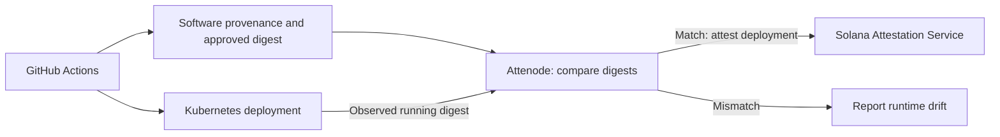

# Attenode

**Verifiable identity for production software.**

Attenode connects software provenance with runtime state and constructs verifiable deployment attestations using Solana Attestation Service (SAS).

## Problem

CI/CD can establish what was built and what was intended to be deployed. That evidence alone does not independently prove that the same artifact is running in production. Manual changes or deployments outside the trusted pipeline can cause runtime state to diverge from the approved artifact.

## How it works

The intended MVP flow is GitHub Actions → software provenance → Kubernetes deployment → Attenode → SAS.

Attenode will compare the container digest observed in Kubernetes with the artifact approved by the deployment flow. A matching deployment can receive a SAS attestation linking its repository, commit, artifact and environment. Subsequent comparisons can detect runtime drift.



This diagram describes the target MVP; provenance verification and Kubernetes observation are still on the roadmap. An attestation records an issuer's deployment claim at a point in time. Its continued existence does not prove that runtime state remains unchanged.

### Trusted deployment and runtime drift

1. GitHub Actions builds a container with digest `sha256:aaa…` and supplies provenance for an approved commit.
2. Kubernetes runs that digest. Attenode observes a match and can attest the deployment.
3. Someone later changes the image outside the trusted flow to `sha256:bbb…`.
4. A new runtime comparison detects the mismatch. The previous attestation describes the earlier deployment, not the changed runtime.

## Attestation format

`DeploymentAttestationV1` serializes six string fields:

| Field | Meaning |
| --- | --- |
| `repository` | Source repository |
| `commitSha` | Git commit SHA |
| `artifactDigest` | Container artifact digest |
| `environment` | Deployment environment |
| `provenanceProvider` | Provenance provider; empty string when absent |
| `deployedAt` | Deployment timestamp |

## Current status

TypeScript/NodeNext prototype using `sas-lib@1.0.10` and `gill@0.14.0`. Implemented:

- Deployment model, validation and SAS payload serialization.
- Deterministic Credential, Schema and Attestation PDA derivation.
- SAS instruction and Gill transaction construction.
- Idempotent execution orchestration with injected signers and client/transport: skip existing Credential and Schema, reject an existing Attestation nonce, and await confirmation in dependency order.
- Offline executor tests covering bootstrap, collisions and failure propagation.

The current Schema creation flow uses version `1`. Attestation nonce and expiry are explicit inputs; expiry is a Unix timestamp in seconds. The planned MVP policy is 30 days, supplied by the caller.

**Real Devnet submission has not been completed. Attenode is not production-ready.** Offline tests do not validate live RPC behavior or on-chain acceptance.

## Local development

Install dependencies with `npm install` when setting up a local checkout. With dependencies installed, these commands run the TypeScript check and offline SAS examples/tests:

```sh
npm run check
npm run demo:sas
npm run demo:sas:onchain
npm run demo:sas:transactions
npm run test:sas:executor
```

The demos construct payloads, instructions or unsigned transactions. Where signers are needed, they are generated in memory. The executor tests use fake transports and do not contact RPC. Despite its name, `demo:sas:onchain` only constructs instructions offline.

`npm test` is currently a placeholder; use `npm run test:sas:executor` for the executor checks. There is no submission CLI.

## Security

Local wallet and key material belongs under `.local/`, which is ignored by Git, and must **never be committed**. Keep private keys, credentials and environment secrets out of source code, examples, logs and attestations. Review staged files before publishing; `.gitignore` does not protect files already tracked by Git.

The execution layer receives signers and RPC dependencies from its caller and never loads a wallet. Before live execution, verify the cluster, signer authorization, funding, existing account ownership and schema compatibility. A confirmation failure can leave transaction outcome uncertain; inspect the attempted signature before retrying.

Runtime claims depend on trusted provenance verification, Kubernetes observations and issuer authorization. Those integrations and their trust boundaries require validation before production use.

## Roadmap

- Complete the first Devnet Credential → Schema → Attestation execution.
- Verify existing account ownership and compatibility; reconcile uncertain transaction outcomes.
- Integrate GitHub Actions provenance and approved artifact digests.
- Observe Kubernetes runtime digests and detect deployment drift.
- Provide deployment verification output and document operational trust boundaries.

## Hackathon

Attenode is being developed for the **Colosseum World's Fair Solana hackathon**. The MVP focuses on connecting an approved software artifact to an observed Kubernetes deployment and a verifiable SAS deployment identity.
